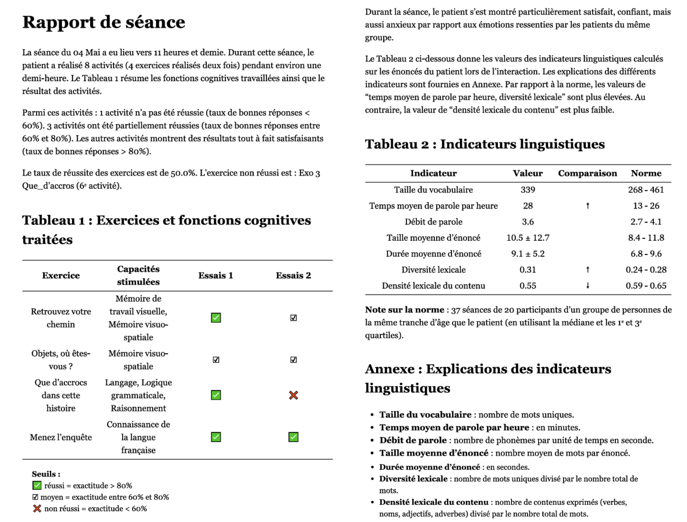
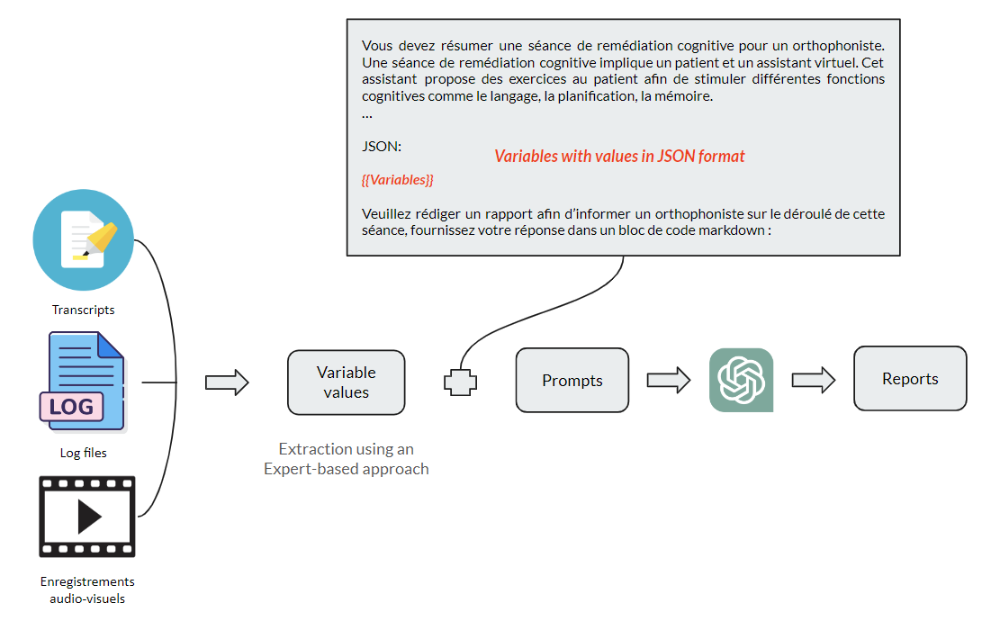

# Remediation Session Reporting System

This repository provides tools for generating comprehensive reports from remediation sessions, adaptable to various datasets beyond the original THERADIA corpus.

## Overview
<!---
The report generation process relies on data extracted from multiple sources:

- Dialogue Transcripts: Capture participant dialogue turns.
- Log Files: Record session metadata and exercise results.
- Audiovisual Recordings: Enable emotion recognition during the session.
- Exercise Information: Details about the cognitive abilities simulated in each exercise.
-->

The system processes multi-modal session data to produce structured reports containing:
1. **Contextual Information**: Includes session time, duration, number of activities, and exercises performed.
2. **Results**: Provides counts of failed (`num_raté`) and moderately successful (`num_moyen`) activities, overall success rate (`taux_réussite`), and a list of failed exercises (`exo_failed`).
3. **Affect**: Details the participant's salient emotions (`emo_state`) during the session, separating positive and negative emotions.
4. **Language**: Offers a linguistic analysis, highlighting variables above (`indicateur_higher`) or below (`indicateur_lower`) the population norm.

An example of the generated report is shown below:

<p align="center">
  
</p>

## Key Features
- **Multi-source Integration**: Combines dialogue transcripts, logs, and audiovisual data
- **Two Generation Methods**: 
  - Template-Based: A structured, expert-driven approach involving iterative refinement
  - LLM-Based: Leveraging Large Language Models (e.g., GPT-4) for low-resource settings
- **Customizable**: Adaptable to different datasets and domains

## Quick Start
### Installation
```bash
conda env create -f environment.yml
conda activate Remediation-Sessions-Summarization
```

### Basic Usage

#### Template-Based Reports
```bash
# Generate structured report using predefined templates
python generate/main_phrases_trous.py "code:M01E;seance:1"
```

#### LLM-Based Reports  
```bash
# Generate natural language report using GPT-4
cd MRG_LLMs
python main.py --code M01E --seance 1 --model gpt-4
```

## Data Requirements
<!---
### Example Data - THERADIA
Example data from the THERADIA corpus is provided in `./data`. To automatically generate a report, the following data sources are required:

```
csv_name = f"{code}_seance{seance}_*_audio_farfield_trs.csv"
log_name = f"{code}_seance{seance}_*.log"
audio: /data/yongxin/THERADIA_MRG/Data/WavsProcessed/{participant}"
video: /data/sauvegarde/processed_theradia_data_v0/private_dataset/{group}-subjects/{participant}/{participant}_seance{num_seance}_*/Video/video_segments_farfield
```
-->

Examples of data from the THERADIA corpus are provided in `./data`.

### Core Data Sources

1. **Dialogue Transcripts** (CSV):
- Required columns: Each row (except the first) represents a participant's dialogue turn. The columns correspond to:
    - `segment_id`: Unique identifier for the dialogue turn (begins from `1`).
    - `start_time`: Start time of the turn (in milliseconds).
    - `end_time`: End time of the turn (in milliseconds).
    - `content`: Text content of the dialogue turn.
- Example format:
    ```
    segment_id	start_time	end_time	content
    A15E_2_001	0	7360	<di> <nv> je vais très bien merci
    A15E_2_002	8110	16500	<nv> hm hm pas pas vraiment il est tôt encore
    ```

2. Session Logs:
- Must contain:
    - Session start time (`ENRG`) and end time (`STOP`)
    - Exercise metadata (`LOG|REP|...Exo...`)
    - Results (`LOG|ENDGAME|`)

- Example excerpt:
    ```
    00:00:00:000 - ENRG|2021_12_10_10_25_2  # Session start time  
    00:01:28:999 - LOG|SETVAR|repetition|1   # Exercise repetition  
    00:01:29:842 - LOG|REP|2285|**Exo 1 Retrouvez votre chemin  # Exercise name  
    00:01:29:876 - LOG|TXT|373|Vous allez donc pouvoir commencer avec le premier exercice.  
    00:03:53:918 - LOG|ENDGAME|0             # Exercise result  
    00:03:55:518 - LOG|TXT|2504|Vous venez de terminer le premier exercice de cette deuxième séance ! Comment ca s'est passé cette fois-ci ?  
    00:04:06:654 - LOG|REP|2787|Ne sais pas  
    00:04:58:232 - LOG|SETVAR|repetition|2   # Exercise repetition  
    00:06:22:846 - LOG|ENDGAME|-1            # Exercise result  
    00:06:23:495 - LOG|REP|2338|**Exo 1 Retrouvez votre chemin  # Exercise name  
    00:06:24:013 - LOG|REP|1693|**Diminution des performances**  
    00:06:24:046 - LOG|TXT|536|Vous avez eu quelques difficultés cette fois-ci ?  
    00:06:48:044 - LOG|SETVAR|exercice|2  
    00:06:48:910 - LOG|REP|2286|**Exo 2 Objets où êtes-vous ?  
    00:49:44:658 - STOP                       # Session end time
    ```

3. Audiovisual Recordings:
- Recommended: 16kHz audio, standard video formats 
- Preprocessing available via `emotion_analysis/Preprocess.py`

### Custom Data Adaptation
Modify these configuration points:
- `settings.yaml` - Path configurations
- `dialogues_theradia.py` - CSV processing
- `logs_theradia.py` - Log file parsing
- `exo_stimulated_abilities()` - Exercise mappings

<!---
1. CSV File:
- Mandatory Columns: Same as THERADIA (`segment_id`, `start_time`, `end_time`, `content`).
- Customization: Modify [./generate/dialogues_theradia.py](./generate/dialogues_theradia.py) for custom needs.
- Key Variables:
```
num_tokens_unique, lexical_diversity_TTR, duration_utterance, num_output_pho, num_token_per_utterance # Used later in the main script
```

2. Log File:
- Format: Match the THERADIA log structure (metadata, exercise names/results). 
Must include session metadata (e.g., session_date, end_time, results, propos_du_sujet), and use the same format as indicated in the above excerpt example.
- Customization: Modify [./generate/logs_theradia.py](./generate/logs_theradia.py).
- Exercise Mapping: Update `exo_stimulated_abilities(exe_order)` with your exercise details.

3. Audio/Video Files:
- Ensure 16,000 Hz frame rate or preprocess with [./emotion_analysis/emoReco_MRG/Preprocess.py](./emotion_analysis/emoReco_MRG/Preprocess.py).
-->

## System Architecture

### Overview
The system is organized into four core modules, each handling a specific aspect of the report generation pipeline:

| Module               | Key Scripts                                      | Functionality                              |
|----------------------|--------------------------------------------------|--------------------------------------------|
| **Data Extraction**  | `dialogues_theradia.py`, `logs_theradia.py`      | Processes raw inputs into structured data  |
| **Emotion Analysis** | `emotion_pipeline.py`, `prediction_audio_video.py` | Multimodal emotion recognition            |
| **Statistical Analysis** | `calculate_norme.py`, `descriptors_stat_csv.py` | Calculates population norms               |
| **Report Generation** | `main_phrases_trous.py` (template), `MRG_LLMs/main.py` (LLM) | Produces final reports         |

> **Note**: For complete variable documentation including:
> - Source files
> - Descriptions
> - Version compatibility
> 
> See [VARIABLES_REFERENCE.md](./docs/VARIABLES_REFERENCE.md)

### Detailed Script Reference
For developers needing deeper implementation details, below is a comprehensive reference of all key scripts:

| Directory               | Script                        | Key Functionality | Inputs | Outputs |
|-------------------------|-------------------------------|-------------------|--------|---------|
| `generate/`             | `dialogues_theradia.py`       | Extracts linguistic features from transcripts | Dialogue CSV | Linguistic features JSON |
| `generate/`             | `logs_theradia.py`            | Parses session metadata from logs | Session log file | Structured exercise data |
| `emotion_analysis/`     | `emotion_pipeline.py`         | End-to-end emotion processing | Audio/video files or preprocessed CSVs | Salient emotions for report |
| `data/`                 | `Dataset.py`                  | Custom dataset handler | THERADIA corpus | Normalized dataset objects |

> **Note**: The complete script reference table is available in [SCRIPT_REFERENCE.md](./docs/SCRIPT_REFERENCE.md) for maintainability.

## Emotion Analysis Pipeline

### One-Command Solution
The emotion analysis has been integrated into the main report generator script `./main_phrases_trous.py`.
Generate complete reports with emotion analysis using:
```
python generate/main_phrases_trous.py "code:M01E;seance:1"
```
Automatically handles:
1. Emotion prediction from audio/video
2. Statistical analysis
3. Salient emotion extraction
4. Report generation

### Emotion Processing Pipeline
1. **Prediction**
```
# Run standalone prediction (optional)
python prediction_audio_video.py --id_participant M01E --output_path /custom/path/results/
```
Output Example (`M01E_seance1.csv`):
```csv
	audio_file	trs	emo_lables	probs_all
1	/M01E/M01E_seance1_0405/M01E_1_002.wav	un peu un peu soucieuse	['anxious', 'desperate', 'frustrated', 'happy', 'relaxed', 'satisfied']	{'annoyed': 23.274272921631457, 'anxious': 51.80646086828975, 'confident': 22.81859077749761, 'desperate': 41.69375231056758, 'frustrated': 72.16825609791601, 'happy': 54.40786616556508, 'interested': 23.422596444575277, 'relaxed': 50.23694646324033, 'satisfied': 54.141140397339186, 'surprised': 27.316351014443462}
```

Key Locations:
- Default output: `./emoReco_MRG/`
- Archived results: `./emotion_analysis/emoReco_MRG_archived/`
  - Test set: `ER_results_test_set/`
  - MCI samples: `ER_results_samples/`

2. **Statistical Analysis**: 
  ```
  # Core analysis script
  from PredictedEmo_Analysis import getSalientEmotions
  results = getSalientEmotions(
                  emotion_labels,
                  df_subject,
                  df_testset,
                  num_subjects
              )
  ```

**Output Files**:
- Archived results: `./emotion_analysis/emoReco_MRG_archived/`
  - Intensity metrics: `LabelsProbability_TestSet.csv` 
  - Frequency metrics: `LabelsFrequency_TestSet.csv`

3. **Report Integration**: 
  ```
  # EmotionPipeline usage in main generator
  pipeline = EmotionAnalysisPipeline(
      settings_path="settings.yaml",
      participant="M01E",
      session=1
  )
  ```
- [emotion_pipeline.py](./emotion_analysis/emotion_pipeline.py): End-to-end emotion processing.
- Uses `run_analysis()` from `EmotionAnalysisPipeline` to obtain final formatted emotions dictionary (e.g., `{'satisfied': 10, 'anxious': 6}`).
- The main generation script ([main_phrases_trous.py](./generate/main_phrases_trous.py)) flags emotions above the median and reports salient positive/negative emotions.

### Models & Data
- **Pretrained Models**: [./emotion_analysis/models](./emotion_analysis/models)
  - Download link: [LINK](./emotion_analysis/models)
- **THERADIA-WoZ Corpus Test Set Participants**:
  - A04E, A03E, A02E, A01E (2 sessions each)
  - A02D, A02C, A02B, A02A, A01D, A01C, A01B, M08E, M09E (1 session each)
- **Test Set Predictions**: 
[LabelsProbability_TestSet.csv](./emotion_analysis/emoReco_MRG_archived/LabelsProbability_TestSet.csv)

### Key Notes
- The model predicts emotion presence/absence and intensity (we use intensity for analysis).
- Salient emotions are determined by comparing against the THERADIA-WoZ test set.

## Norms Calculation
This section covers the calculation of linguistic norms (language-related variables) and emotion norms (affective states) by comparing participant data against the THERADIA corpus reference groups.

### Linguistic Norms
**Purpose**: Compare a participant’s language patterns (e.g., lexical diversity, utterance length) against the elder group in the THERADIA corpus.

Calculated using `calculate_norme.py` and `User_Info_Stat.csv`.

Steps:
1. Generate User Statistics:
```
python descriptors_stat_csv.py  # Output: ./statistics/User_Info_Stat.csv  
```
2. Calculate Norms:
```
python calculate_norme.py  # Uses User_Info_Stat.csv for comparisons  
```

**Customization**: 
- Modify `calculate_norme.py` and `descriptors_stat_csv.py` for your own dataset.

### Emotion Norms
**Purpose**: Compare a participant’s emotional profile (intensity/frequency of emotions) against the THERADIA-WoZ test set.

**Statistical Comparisons**: 
- Use functions in `PredictedEmo_Analysis.py` to process session-specific data and calculate norms (e.g., median intensity, frequency distributions).

**Customization**:
- Comparison Groups: Choose between:
  - Individual history: Compare across a participant’s sessions. 
  - Population norms: Use the THERADIA-WoZ test set (default).
- Modify thresholds or metrics in `PredictedEmo_Analysis.py`.

**Reference Test Set**:  
Participants in `LabelsProbability_TestSet.csv`:
- 4 participants with 2 sessions each (A04E, A03E, A02E, A01E).
- 9 participants with 1 session each (A02D, A01B, M08E, etc.).

### Key Notes
- **Outputs**:
  - Linguistic norms → Integrated into reports via `User_Info_Stat.csv`.
  - Emotion norms → Returned as sorted dictionaries (e.g., `{'satisfied': 10, 'anxious': 6}`).
- **Flexibility**: Scripts allow adjustments for new corpora or analysis criteria.

## Advanced Usage 
This section covers two methods for generating reports:
- Template-based (rule-driven, deterministic).
- LLM-based (GPT-4, dynamic generation).

### Template-Based Generation
**Purpose**: Generate structured reports using predefined templates.
```
# Using preprocessed emotion data
python generate/main_phrases_trous.py "code:M01E;seance:1"

# With fresh emotion analysis
python generate/main_phrases_trous.py "code:A01B;seance:1"
```

Outputs include:
- HTML reports
- Markdown versions
- Structured JSON for LLM processing
  - **Extracted Variables**: Saved as JSON for future LLM adaptation (e.g., `./MRG_LLMs/A15E_seance2_1012.json`).

### LLM-Based Generation
**Purpose**: Dynamically generate reports using extracted variables and GPT-4.

<p align="center">
  
</p>

Workflow:
1. **Input**: Variables from JSON (e.g., `A15E_seance2_1012.json`). 
2. **Prompt**: Customizable template (e.g., `./prompts/JSON_variables.txt`). 
3. **Generation**:
```
cd MRG_LLMs
python ./main.py --code A15E --seance 2 --prompt ./prompts/JSON_variables.txt --save_fp ./results/variables_4_A15E_2.json --model gpt-4
```

**Outputs**:
- JSON: Full prompt and response (e.g., `./results/variables_4_A15E_2.json`).
- HTML Report: `./results/JSON_variables/gpt-4_A15E_seance2.html`.
- Markdown: Extracted response only (e.g., `.md` counterpart).

For details, see [./MRG_LLMs/README.md](./MRG_LLMs/README.md)

## Customization
### Adapting to New Datasets
1. Data Formatting:
- Update `settings.yaml` with new paths
- Ensure CSV/log/audio formats match specifications
- Modify CSV/log parsers in `dialogues_theradia.py` and `logs_theradia.py`

2. Exercise Mapping:
- Update `exo_stimulated_abilities()` with new exercise details

3. Reference Norm:
- Generate new reference statistics using `descriptors_stat_csv.py`
- Adjust comparison logic in `calculate_norme.py`

3. Emotion Analysis: (Optional)
- Train new models or adapt existing ones
- Modify statistical analysis in `PredictedEmo_Analysis.py`

## Evaluation

Expert evaluation comparing template-based and LLM approaches is available in:
- **Analysis**: `expert_evaluation_results/eval_results.ipynb` - Complete statistical analysis and visualizations
- **Data**: `expert_evaluation_results/` - Anonymized expert annotations from 8 evaluators (4 professional orthophonists, 4 advanced students)
- **Metrics**: 9 evaluation criteria including fluidity, conciseness, relevance, coherence, and clinical utility
- **Results**: Comparative radar charts, box plots, and inter-annotator agreement analysis

The evaluation demonstrates the relative strengths of both approaches across different report quality dimensions.

## Support
For questions or issues, please contact <yongxin.zhou@univ-grenoble-alpes.fr>.
